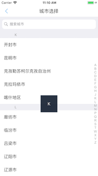

# MRJCitySelect

[](https://travis-ci.org/mrjlovetian@gmail.com/MRJCitySelect)
[](http://cocoapods.org/pods/MRJCitySelect)
[](http://cocoapods.org/pods/MRJCitySelect)
[](http://cocoapods.org/pods/MRJCitySelect)

## Example

### 效果图





### 如何使用

```
CitySelectViewController *vc = [[CitySelectViewController alloc] init];
        vc.navTitle = @"城市选择";
        vc.cityBlock = ^(CityModelManger *city) {
            MRJLog(@"选择的城市是%@", city.regionName);
        };
```

## Requirements

## Installation

MRJCitySelect is available through [CocoaPods](http://cocoapods.org). To install
it, simply add the following line to your Podfile:

```ruby
pod 'MRJCitySelect'
```

## Author

mrjlovetian@gmail.com, mrjlovetian@gmail.com

## License

MRJCitySelect is available under the MIT license. See the LICENSE file for more info.


